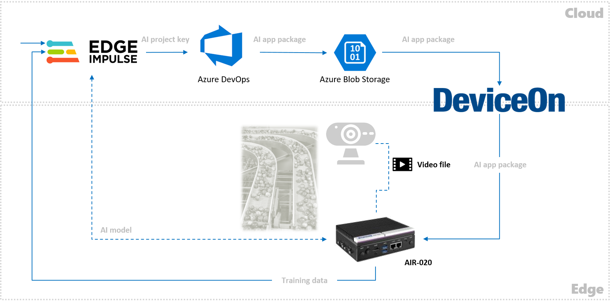
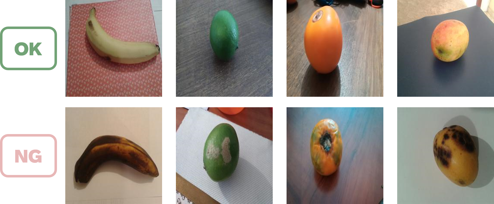

# DeviceOn-ARM_Edge_AI_Solution
## Overview

A typical Machine Vision solution pipeline consists of data ingestion, data preprocessing, data labeling, model training and validation, model optimization, application development, application deployment and edge inference. Tasks and processes that could be ignored for POC purpose would become key success factors for production stage, such as integrated pipeline from cloud training to edge inference, continuous deployment for AI application updates, remote monitoring, management over large-scale edge AI devices and further analytics of rich inference results. This best practice is to bridge those gaps with hand-on implementation details hopefully to bring every machine vision project to real edge production.

> ### **Architecture**

When it comes to a production stage for edge AI solutions, the topic of continuous maintenance includes lots of extra tasks to be considered and dealt with. For example, it’s necessary to re-train an AI model owing to precision bias or target objects changed. The frequency of AI application installation and update increases to a great degree. The remote capability to manage massive and unattended edge AI devices is required. Edge AI devices are rugged enough to operate normally and continuously in terrible environments, and so on. To help deal with such problems, Advantech provides customers with Azure Custom Vision, Azure DevOps, DeviceOn and AIR-020 with NVIDIA Jetson. With the aids of these products and services, it can help construct a complete Edge AI solution and accelerate realization of solution landing or production stage migration.

| Category  | Product | Key Benefits & Features |
| ------------- | ------------- | ------------- |
| ML SaaS | **[Edge Impulse](https://www.edgeimpulse.com/)** | Easily customize your own state-of-the-art AI models for your **dedicated use case** that no ML expertise is required |
| Dev. Pipeline | [Azure DevOps](https://azure.microsoft.com/en-us/products/devops/) | Complete or complementary services provision to automate development pipeline for packaging your AI application and cross-region development|
| Deployment & Mgmt. | **[DeviceOn](https://campaign.advantech.online/en/DeviceOn/index.html#SolutionPackages)** | Central mgmt. platform to remotely update AI applications (OTA), and monitor and control large-scale devices at ease |
| AI Edge | **[AIR-020](https://www.advantech.com/en/products/65f20c25-f6ef-4ab5-be3c-b7dfa7a833b3/air-020/mod_fcf216c8-3495-4809-b815-61dc008d53a4)** | Powered by NVIDIA Jetson series and featuring an ultra-compact and rugged design with 12 ~ 24V wide power input & -10 ~ 55 °C operating temperatures |

> ### **Use Case**

In this repoitory, a use case for a quality control system in fruit is used to demonstrate how Advantech supports customers to construct a production-stage edge AI solution with edge AI related products by Advantech. The design of quality control systems in food has become an essential element in research to ensure a state suitable for consumption. It is necessary to develop automatic and efficient systems that can verify their condition before distribution. As a result we tried adopt the following dataset with a deep learning-based algorithm from Edge Impulse for the identification of the fruits and the state in which they are.

The whole dataset has 8 different fruits:
  
    -banana
    -lemon
    -lulo
    -mango
    -orange
    -strawberry
    -tamarillo
    -tomato 
 *Source from: Pachon Suescun, Cesar Giovany; Pinzón Arenas, Javier Orlando; Jiménez-Moreno, Robinson (2020), “Spoiled and fresh fruit inspection dataset”, Mendeley Data, V1, doi: 10.17632/6ps7gtp2wg.1* 
 
Two thousand images of each one of the types of fruits are acquired for a total of 16000 samples. Half of them correspond to fresh fruits and the other half to non-fresh or spoiled fruits. For the acquisition of the dataset, changing of backgrounds, rotation of the fruits, distance of capture, and light variations were made, in order to make it robust. 

In the following sections, let’s find out how the above-mentioned Advantech edge AI products can be adopted to help construct an edge AI application into a production phase in which continuous maintenance is also considered. It won't end in POC and moreover aimed to create a continuously operational edge AI application.

* #### [**ML | Label training data**](ML%20|%20Label%20training%20data.md)

* #### [**ML | Train an accurate enough AI model**](ML%20|%20Train%20an%20accurate%20enough%20AI%20model.md)

* #### [**DEV | Encapsulate a portable AI application**](DEV%20|%20Encapsulate%20a%20portable%20AI%20application.md)

* #### [**DEV | Automate AI lifecycle**](DEV%20|%20Automate%20AI%20lifecycle.md)

* #### [**OPS | Deploy AI to any edge**](OPS%20|%20Deploy%20AI%20to%20any%20edge.md)

* #### [**OPS | Collect training, inference, and performance data**](OPS%20|%20Collect%20training,%20inference,%20and%20performance%20data.md)

## Reference Resources
### Sample Data for Training and Inference

* [Images for labeling and training](https://data.mendeley.com/datasets/6ps7gtp2wg/1)

### App Uploading and Deployment

* [Wrap an app](https://youtu.be/5wRANEF-nxM?t=171)

* [Select an app then deploy to devices](https://youtu.be/5wRANEF-nxM?t=15)

* [Select a device then deploy an app](https://youtu.be/5wRANEF-nxM?t=36)

### AI Model Deployment and Operation

* [Create a container](https://youtu.be/bilP6FpyU0M?t=109)

* [Container management](https://youtu.be/bilP6FpyU0M?t=145)

### [More about DeviceOn](https://docs.wise-paas.advantech.com/en/Guides_and_API_References/ApplicationServices/1564727799415968385/1564727878040194797/v1.0.2)
